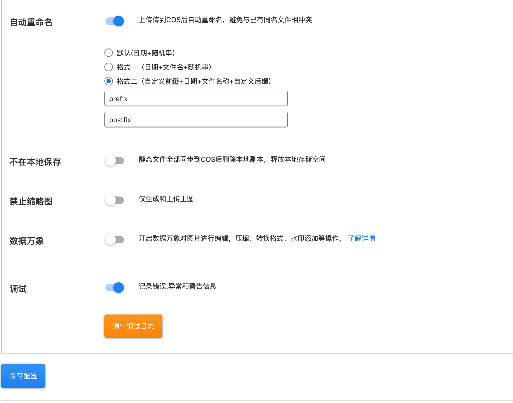

# 腾讯云对象存储插件

## 0.版本依赖

- 依赖 PHP 5.5+ 环境

- GuzzleHttp 6.3.0+ (如果有其它插件引用了 GuzzleHttp 库并低于 6.3.0 版本会引起插件冲突)

- 支持PHP8， 兼容WordPress 5.8

## 1.插件介绍
> WordPress COS插件是一款腾讯云研发的，提供给WordPress站长使用的官方插件。实现网站静态媒体资源与腾讯云COS的互通，有效降低本地存储负载，提升用户访问网站媒体资源的体验。

| 标题       | 名称                                                         |
| ---------- | ------------------------------------------------------------ |
| 中文名称   | 腾讯云对象存储（COS）插件                                  |
| 英文名称   | tencentcloud-cos                                 |
| 最新版本   | 1.0.3 (2021.11.25)                                     |
| 适用平台   | [WordPress](https://wordpress.org/)                     |
| 适用产品   | [腾讯云对象存储（COS）](https://cloud.tencent.com/product/cos)       |
| GitHub项目 | [tencentcloud-wordpress-plugin-cos](https://github.com/Tencent-Cloud-Plugins/tencentcloud-wordpress-plugin-cos) |
| gitee项目 | [tencentcloud-wordpress-plugin-cos](https://gitee.com/Tencent-Cloud-Plugins/tencentcloud-wordpress-plugin-cos) |
| 主创团队   | 腾讯云中小企业产品中心（SMB Product Center of Tencent Cloud）   |

## 2.功能特性

- 支持验证桶名是否有效
- 可配置是否数据万象 CI 图片处理-默认不开启
- 可配置是否保留本地备份-默认不备份
- 本地删除可同步删除腾讯云对象存储 COS 中的文件-默认同步删除
- 支持同步历史附件到 COS
- 支持上传文件自动重命名-支持三种命名格式
- API动态获取域名列表
- 本地调试日志功能
- 支持腾讯云数据万象 CI 文件审核
- 支持在网页中在线预览 office 文档
## 3.安装指引

### 3.1.部署方式一：通过GitHub部署安装

> 1. git clone https://github.com/Tencent-Cloud-Plugins/tencentcloud-wordpress-plugin-cos
> 2. 复制tencentcloud-wordpress-plugin-cos目录中的tencentcloud-cos文件夹拷贝到wordpress安装路径/wp-content/plugins/文件夹里面

### 3.2.部署方式二：通过WordPress官网插件中心下载安装

> 1. 前往[WordPress插件中心](https://wordpress.org/plugins/tencentcloud-cos/)点击下载
> 2. 你的WordPress站点后台=》插件=》安装插件。点击左上角的"上传插件"按钮，选择上一步下载的zip安装包

### 3.3.部署方式三：通过本地WordPress站点插件中心部署安装

> 1. 你的WordPress站点后台=》插件=》安装插件。在页面搜索框输入tencentcloud-cos
> 2. 点击"安装"按钮，就会自动下载安装插件

## 4.使用指引

### 4.1.界面功能介绍

> 上图主要是配置COS插件的腾讯云参数，包括secretId、secretKey、所属地域、空间名称、是否自动重命名、不在本地保存、是否禁止生成缩略图、是否开启数据万象功能

> 上图中"附件同步"可同步WordPress媒体库中的全部文件到腾讯与的COS。 "一键替换"可替换网站内容中所有静态文件地址为腾讯云COS文件地址

> 新增调试功能，开启后如果插件报错，错误信息能保留在本地日志文件中，方便排查问题

> 支持媒体文件在线预览功能，新增腾讯云数据万象 CI 文件审核指引
### 4.2.名词解释
- **自定义密钥**：插件提供统一密钥管理，既可在多个腾讯云插件之间共享SecretId和SecretKey，也可为插件配置单独定义的腾讯云密钥。
- **SecretId**：在腾讯云云平台API密钥上申请的标识身份的 SecretId。详情参考[腾讯云文档](https://cloud.tencent.com/document/product)
- **SecretKey**：在腾讯云云平台API密钥上申请的标识身份的SecretId对应的SecretKey。详情参考[腾讯云文档](https://cloud.tencent.com/document/product)
- **所属地域**：在腾讯云服务器所在地域。详情参考[腾讯云文档](https://cloud.tencent.com/document/product/457/44232)
- **空间名称**：COS服务中存储桶的名称。详情参考[腾讯云文档](https://cloud.tencent.com/document/product/436/41153)
- **访问域名**：存储桶的域名。详情参考[腾讯云文档](https://cloud.tencent.com/document/product/436/6224)
- **是否自动重命名**：开启后，文件上传到腾讯云COS后将自动重命名，避免与已有同名文件相冲突。
- **不在本地保存**：开启后，静态文件同步到腾讯云COS后将删除本地副本，释放本地存储空间。
- **是否禁止生成缩略图**：开启后，上传图片时仅生成和上传主图到腾讯云COS。
- **数据万象**：开启数据万象对图片进行编辑，压缩、转换格式、水印添加等操作。详情参考[腾讯云文档](https://cloud.tencent.com/document/product/460/36540)
- **附件同步**：触发"附件同步"将同步WordPress媒体库中的全部文件到腾讯云COS。首次同步，执行时间会比较长，有可能会因执行时间过长，页面显示超时或者报错。推荐使用官方工具 [COSBrowser](https://cloud.tencent.com/document/product/436/11366)
- **一键替换**：触发"一键替换"将替换网站内容中所有静态文件地址为腾讯云COS文件地址。

## 5.获取入口

| 插件入口          | 链接                                                         |
| ----------------- | ------------------------------------------------------------ |
| GitHub            | [link](https://github.com/Tencent-Cloud-Plugins/tencentcloud-wordpress-plugin-cos)    |
| gitee             | [link](https://gitee.com/Tencent-Cloud-Plugins/tencentcloud-wordpress-plugin-cos)    |
| 插件中心  | [link](https://wordpress.org/plugins/tencentcloud-cos) |

## 6.FAQ

### 为什么打开插件媒体库同步后功能没有生效?
> 1. 腾讯云的COS服务是否正常开启，是否欠费；  
> 2. 首先确认配置参数secretId、secretKey、所属地域和空间名称都是否正确；
> 3. 到腾讯云的COS服务界面查看附件是否有上传；
> 4. 是否有开启防盗链功能；

## 7.版本迭代记录
### 2021.11.25 tencentcloud-wordpress-plugin-cos v1.0.3
- 支持腾讯云数据万象 CI 文件审核
- 支持在网页中在线预览 office 文档

### 2021.8.20 tencentcloud-wordpress-plugin-cos v1.0.2
- 更新对象云存储插件上传文件自动重命名的功能，支持三种不同命名格式。
- 新增本地调试日志功能

### 2020.12.11 tencentcloud-wordpress-plugin-cos v1.0.1
- 支持在windows环境下运行

### 2020.6.22 tencentcloud-wordpress-plugin-cos v1.0.0
- 支持验证桶名是否有效
- 可配置是否数据万象 CI 图片处理-默认不开启
- 可配置是否保留本地备份-默认不备份
- 本地删除可同步删除腾讯云对象存储 COS 中的文件-默认同步删除
- 支持同步历史附件到 COS
- 支持上传文件自动重命名-默认支持
- API动态获取域名列表

## 8.致谢

- 该插件参考了 WordPress 插件 [WPCOS](https://github.com/lezaiyun/wpcos) 及 [Sync QCloud COS](https://github.com/sy-records/wordpress-qcloud-cos) 的实现方法，特此对其主创团队进行致谢。

本项目由腾讯云中小企业产品中心建设和维护，了解与该插件使用相关的更多信息，请访问[春雨文档中心](https://openapp.qq.com/docs/Wordpress/cos.html) 

请通过[咨询建议](https://da.do/y0rp) 向我们提交宝贵意见。
